# Live Stream Countdown Timer

## Instructions for use

### How to use

* On Local: open `countdown_timer\index.html`
* On Oline: open [live-stream-countdown-timer](https://workspace2110.github.io/live-stream-countdown-timer/)

### UI description
  1. UI preview
        
  2. Remaining time of live stream
        
  3. Elapsed time of live stream
        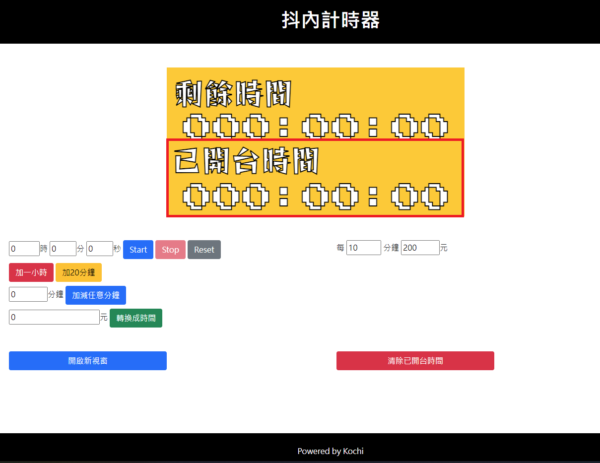
  4. Setting remaining time field
        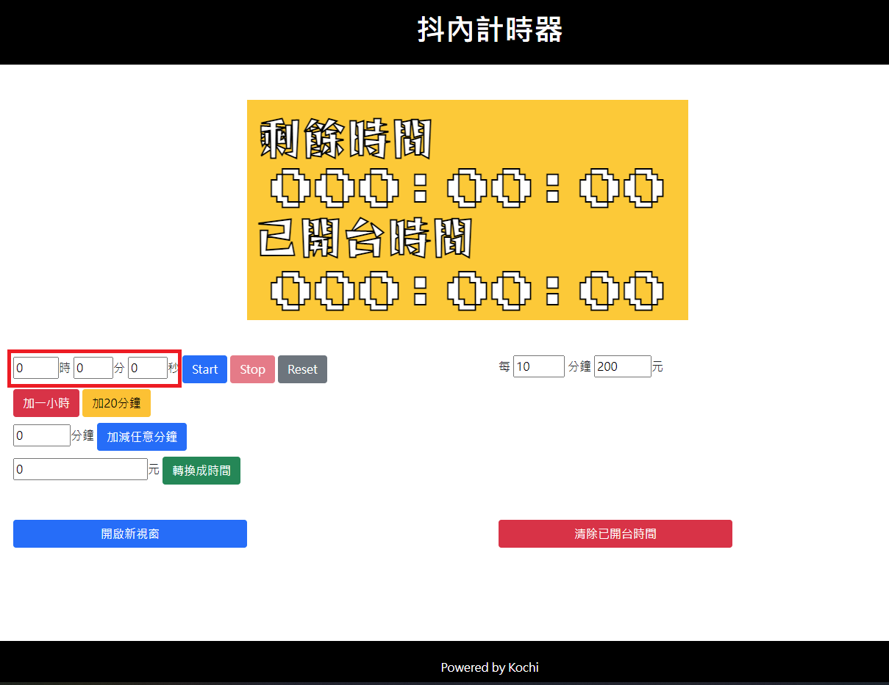
  5. Start countdown button
        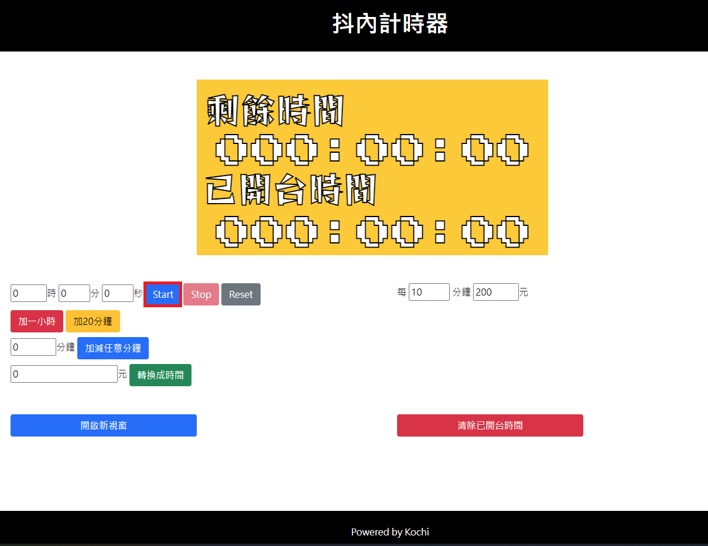
  6. Stop countdown button
        
  7. Reset remaining time button
        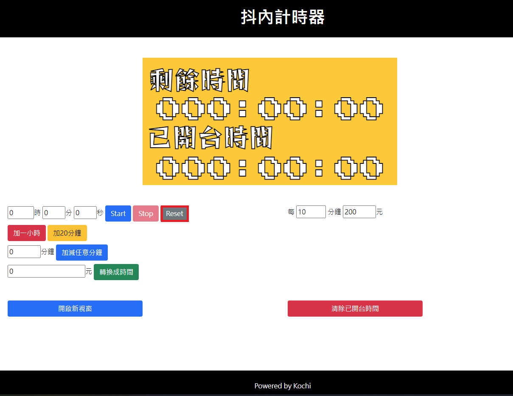
  8. Add one hour to remaining time button
        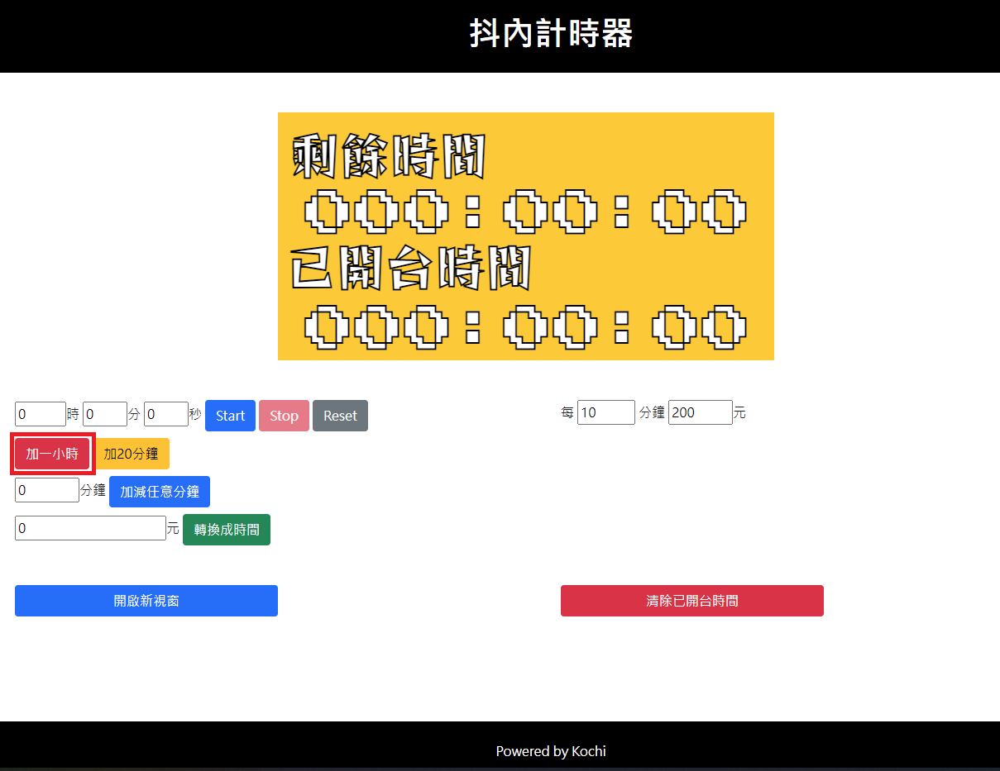
  9.  Add 20 minutes to remaining time button
        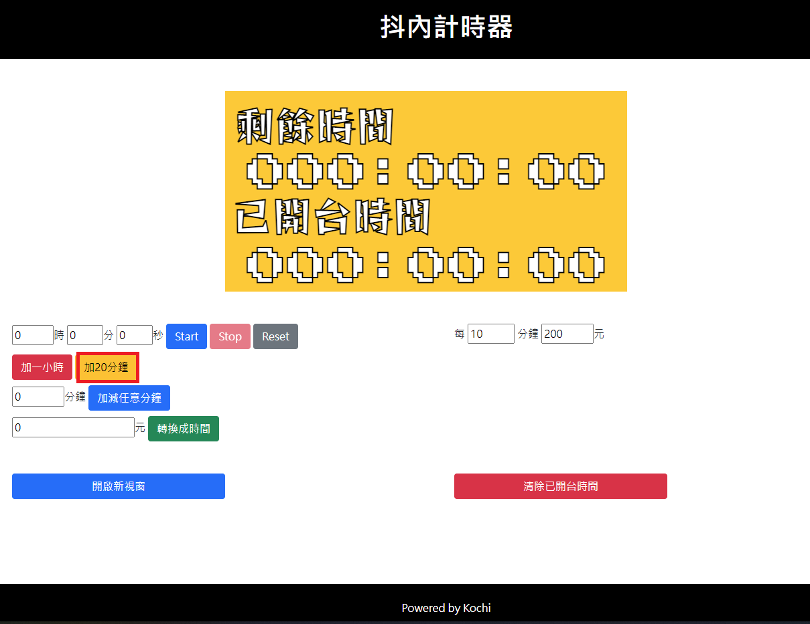
  10. Add customized minutes field and submit button
        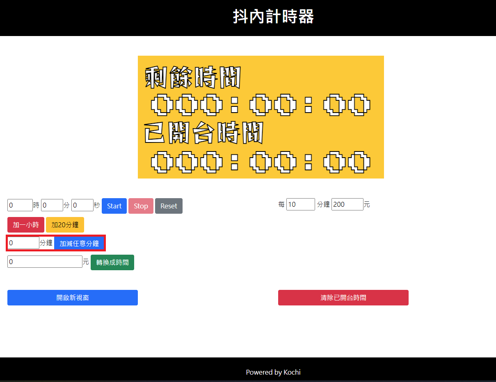
  11. Conver money to time field and submit button
        
  12. Conver money to time rate field
        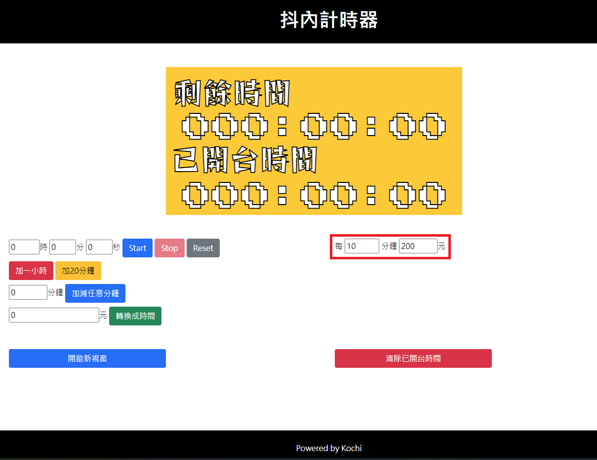
  13. Clean elapsed time button 
        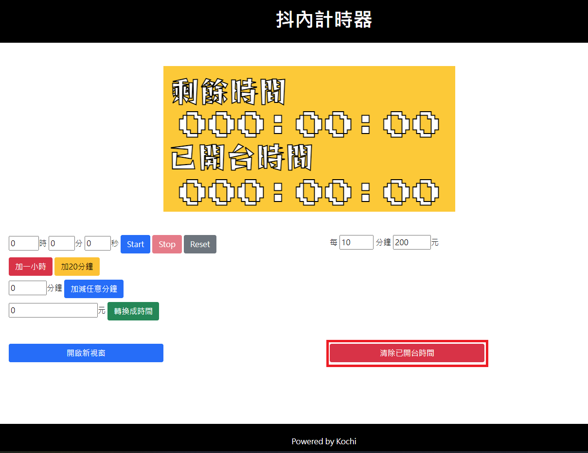
  14. Stop Time to modifed elapsed time
        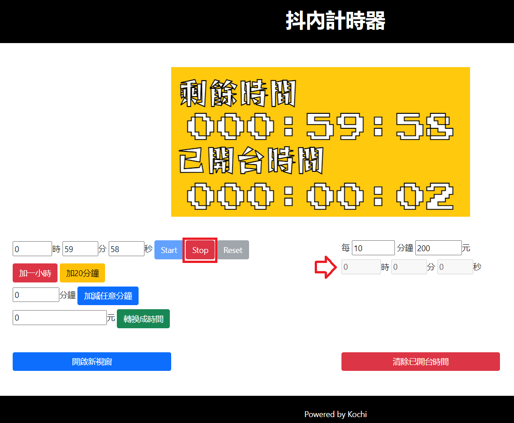
  15. Change elapsed time 
        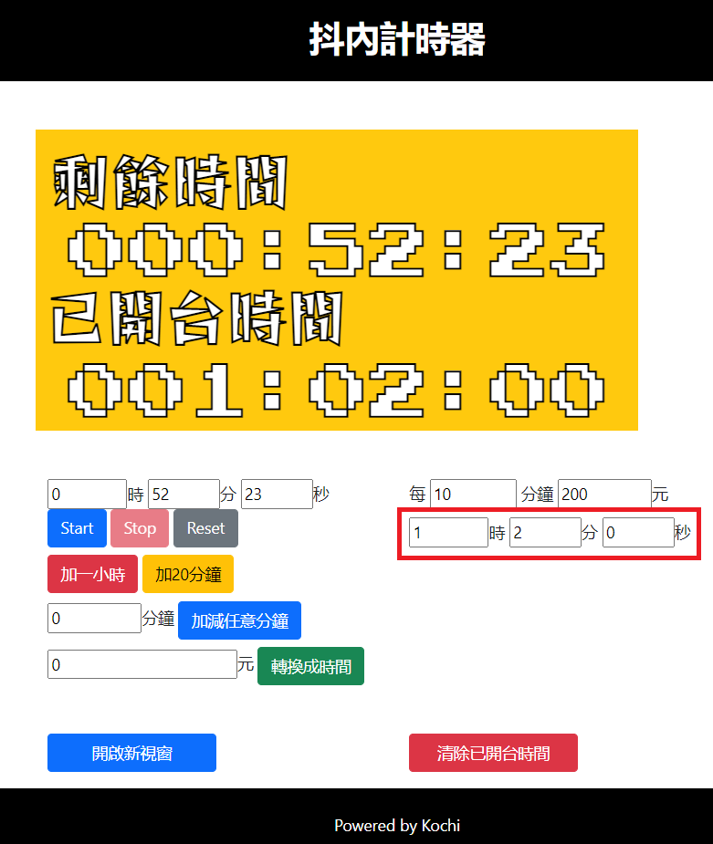

### Background exchange

1. Please check the image conforms to the background rules.
   > **Background size: `height: 300`, `width: 600`** 
   > **Image file formats: `.png`**
2. Copy the image and rename it to `background.png`
3. Move `background.png` to `countdown_timer\res\img`, and override the old one.
4. Go to UI to check if it is successful.

## Development History

| Feature Name | Status | Fix Version |
| :----------: | :----: | :---------: |
| Basic features | Done | 1.0.0~ |
| Elapsed time count up | Done | 1.1.0~ |

## Contributing

Pull requests are welcome. For major changes, please open an issue first to discuss what you would like to change.

Please make sure to update tests as appropriate.

## License
[MIT](https://choosealicense.com/licenses/mit/)
